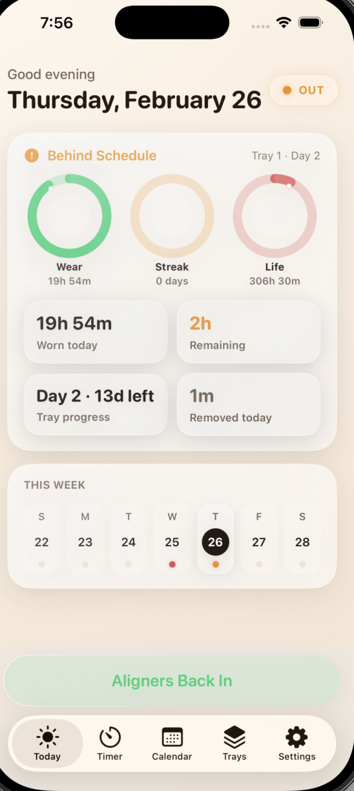
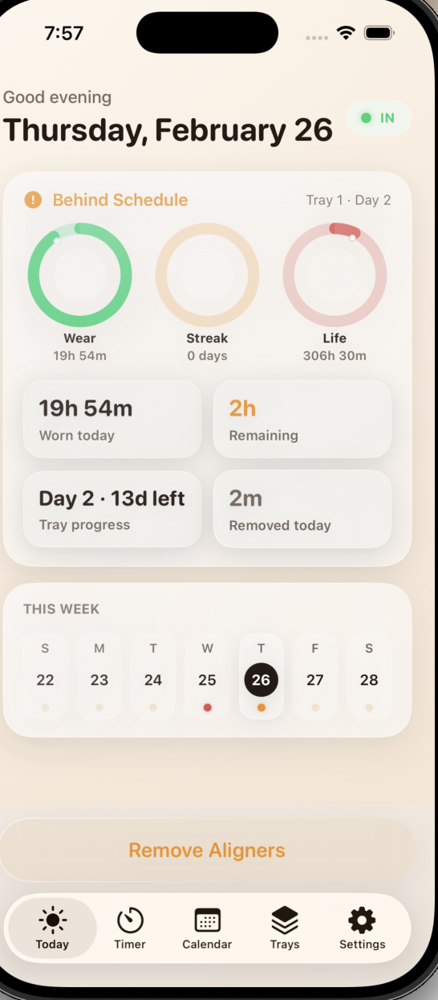
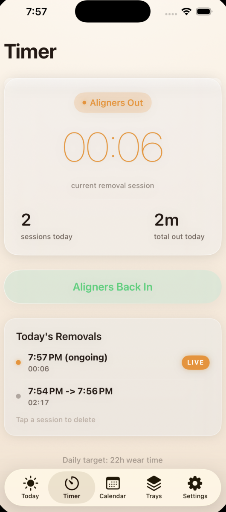
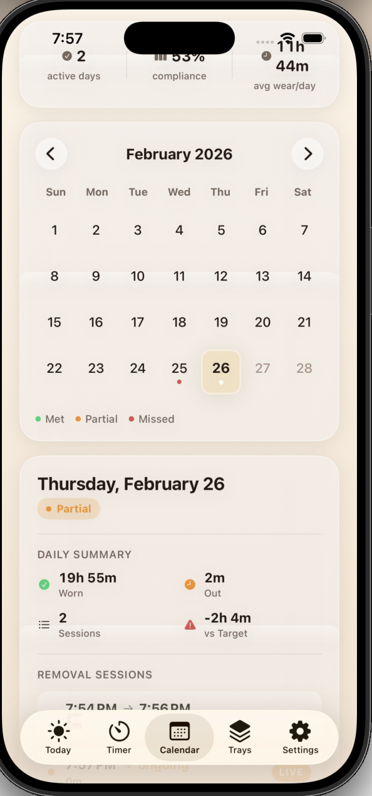
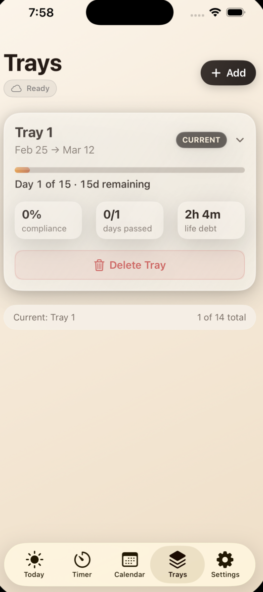
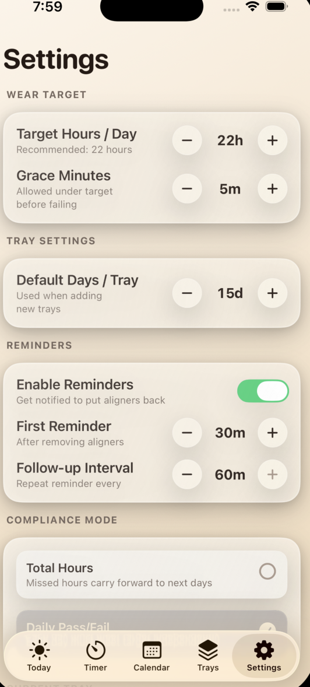
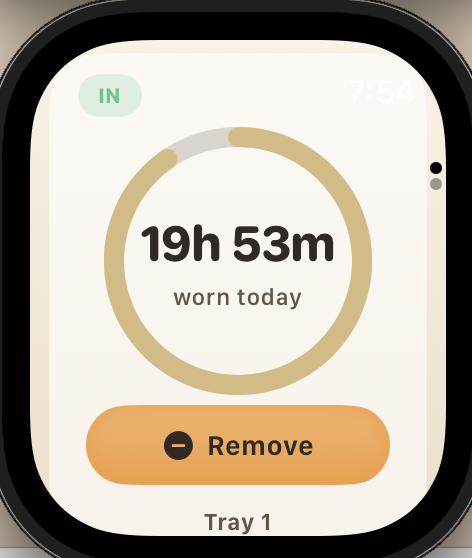
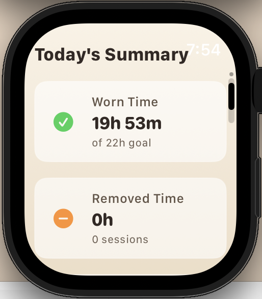
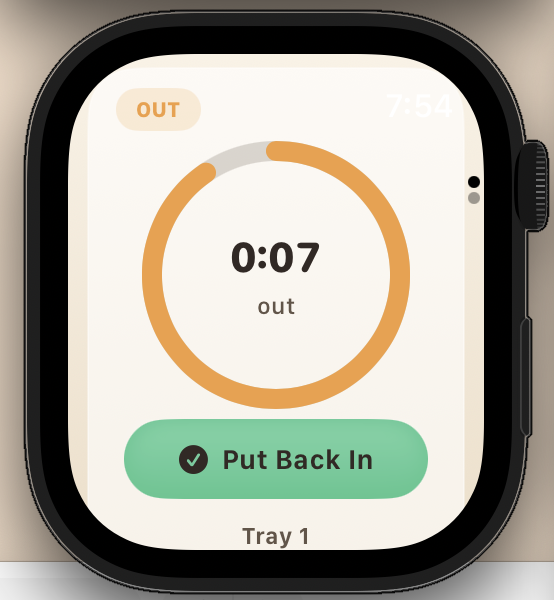
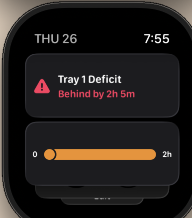

# InvisalignTracker (Native iOS Rewrite)

Native SwiftUI + SwiftData rewrite of the Expo app with feature parity.

## Stack
- Swift 5.10+
- SwiftUI
- SwiftData (sessions, trays, settings)
- async/await in repository/store operations
- iOS 17.0+

## Architecture
- `App/`: app entry, root tabs, dependency wiring
- `Features/`: Today, Timer, Calendar, Trays, Settings (each with `View` + `ViewModel`)
- `Domain/`: pure models/services/business rules
- `Data/`: SwiftData models + repository + state store
- `Shared/`: UI components + theme
- `Tests/`: domain-level tests

## Build
1. Install XcodeGen (if needed): `brew install xcodegen`
2. Generate project: `cd ios-native/InvisalignTracker && xcodegen generate`
3. Open `InvisalignTracker.xcodeproj` in Xcode 15+
4. Run on iOS simulator/device

## Feature Parity Implemented
- Aligner out/in toggle with start/end timestamps
- Live timer for active removal session
- Daily wear/removal calculation
- Daily target/grace progress and on-track state
- Tray management (add/delete/set current)
- Tray progress/compliance stats
- Monthly calendar with pass/warn/fail/day markers
- Settings for target/grace/default tray days/compliance mode
- Full local persistence using SwiftData
- Reset all data

## iOS 16 Fallback
Current code targets iOS 17 to use SwiftData natively. For iOS 16 support, replace SwiftData models/repository with Core Data (same repository protocol), keep Domain/Features unchanged.

---

## Screenshots

### iOS App

  
  
  
  
  
  

### Apple Watch App

  
  
  
  

